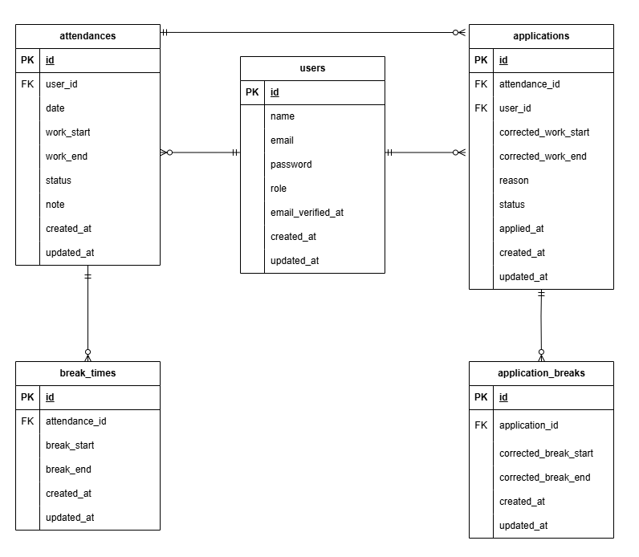

## Attendance-app (勤怠管理アプリ)

# 環境構築  
1. リポジトリをクローンする
```bash
git clone git@github.com:kokoro28k/attendance-app.git
```
```bash
cd attendance-app
```

2. Laravel Sailのインストール  
```bash
docker run --rm \
    -u "$(id -u):$(id -g)" \
    -v "$(pwd):/var/www/html" \
    -w /var/www/html \
    -e COMPOSER_CACHE_DIR=/tmp/composer_cache \
    laravelsail/php82-composer:latest \
    composer require laravel/sail --dev

```

3. .envファイルを作成　　
```bash
cp .env.example .env
```

.env ファイルが以下の内容になっているか確認してください
```  
DB_CONNECTION=mysql
DB_HOST=mysql
DB_PORT=3306
DB_DATABASE=laravel
DB_USERNAME=sail
DB_PASSWORD=password
```

4. Sailの設定ファイルをパブリッシュ（MySQLを選択）
```bash
docker run --rm \
    -u "$(id -u):$(id -g)" \
    -v "$(pwd):/var/www/html" \
    -w /var/www/html \
    -e COMPOSER_CACHE_DIR=/tmp/composer_cache \
    laravelsail/php82-composer:latest \
    php artisan sail:install --with=mysql
```

5. DockerDesktopアプリを立ち上げる  
```bash
./vendor/bin/sail up -d
```

5. APP_KEYの生成  
```bash
./vendor/bin/sail artisan key:generate
```  

6. MailTrapによるメール認証の設定
MailTrapは、以下のリンクから会員登録を行ってください。
https://mailtrap.io/

.env　ファイルを以下の内容に書き換えてください。  
なお、USERNAME、PASSWORDは、MailTrapのSMTPを参照してください。

```
MAIL_MAILER=smtp
MAIL_HOST=sandbox.smtp.mailtrap.io
MAIL_PORT=2525
MAIL_USERNAME=
MAIL_PASSWORD=
MAIL_ENCRYPTION=tls
MAIL_FROM_ADDRESS="hello@example.com"
MAIL_FROM_NAME="Attendance App"
```

設定後は、キャッシュをクリアしてください

```bash
./vendor/bin/sail artisan config:clear
./vendor/bin/sail artisan cache:clear
```

7. マイグレーションとシーディングの実行
```bash
./vendor/bin/sail artisan migrate --seed
```  

### ログイン用ダミーユーザー  
- 管理者  
 email:admin@coachtech.com
 password:password  

- ユーザー1 (西 怜奈)
 email:reina.n@coachtech.com  
 password:12345678  

- ユーザー2 (山田 太郎)  
 email:taro.y@coachtech.com  
 password:12345678

  
8. Laravelのスケジューラを有効にするためのcorn設定　　
```bash
crontab -e　　
```

開いたファイルに、以下の１行を追加してください

```
-   -   -   -   - cd /path/to/project && ./vendor/bin/sail artisan schedule:run >> /dev/null 2>&1
```

※ `/path/to/project` は、このプロジェクトを clone したディレクトリの絶対パスに置き換えてください。  


## 初回実行について

cron の設定を行った時点が 0:00 を過ぎている場合、  
当日の勤怠レコードは自動生成されません。

そのため、初回のみ以下のコマンドを実行して  
勤怠レコードを手動で作成してください。

```bash
./vendor/bin/sail artisan attendance:create-daily
```

翌日以降は cron により毎日 0:00 に自動実行されます。

# URL  
- 開発環境  http://localhost/
- phpMyAdmin  http://localhost:8080/

# 使用技術  
- PHP 8.1(FRM)
- Laravel 10.x
- MySQL 8.4
- Docker/docker-compose
- MailTrap

# ER図  


## テストファイル構成

1. RegisterUserTest.php

- 認証機能（一般ユーザー）

2. LoginUserTest.php

- ログイン認証機能（一般ユーザー）

3. LoginAdminTest.php

- ログイン認証機能（管理者）

4. AttendanceDateTimeTest.php

- 日時取得機能　　

5. AttendanceStatusTest.php

- ステータス確認機能

6. AttendanceStartTest.php

- 出勤機能

7. AttendanceBreakTest.php

- 休憩機能

8. AttendanceEndTest.php

- 退勤機能

9. AttendanceListUserTest.php

- 勤怠一覧情報取得機能（一般ユーザー）

10. AttendanceDetailUserTest.php

- 勤怠詳細情報取得機能（一般ユーザー）

11. AttendanceApplicationUserTest.php

- 勤怠詳細情報修正機能（一般ユーザー）

12. AttendanceListAdminTest.php

- 勤怠一覧情報取得機能（管理者）

13. AttendanceDetailAdminTest.php

- 勤怠詳細情報取得機能（管理者）

14. UserInfoAdminTest.php

- ユーザー情報取得機能（管理者）

15. AttendanceApplicationAdminTest.php

- 勤怠情報修正機能（管理者）

16. VerifyEmailTest  
- メール認証機能
  
以下のコマンドでテストを実行します
```bash
./vendor/bin/sail artisan test  
```
